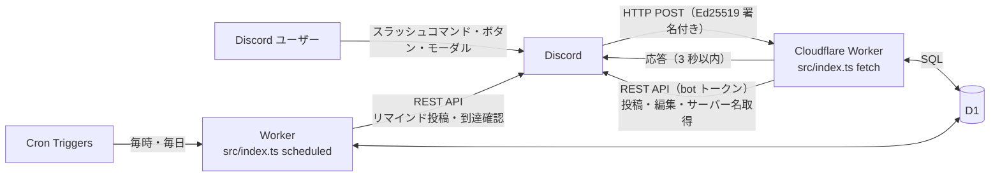
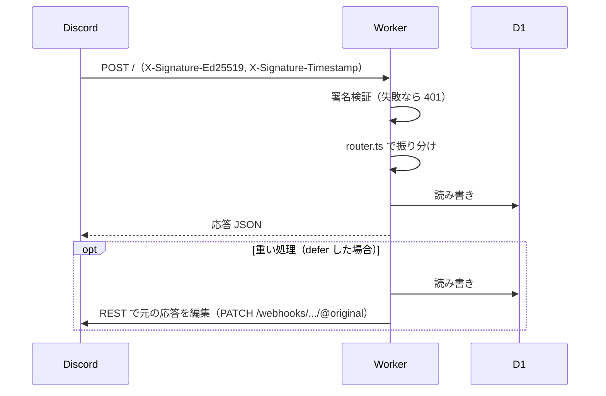
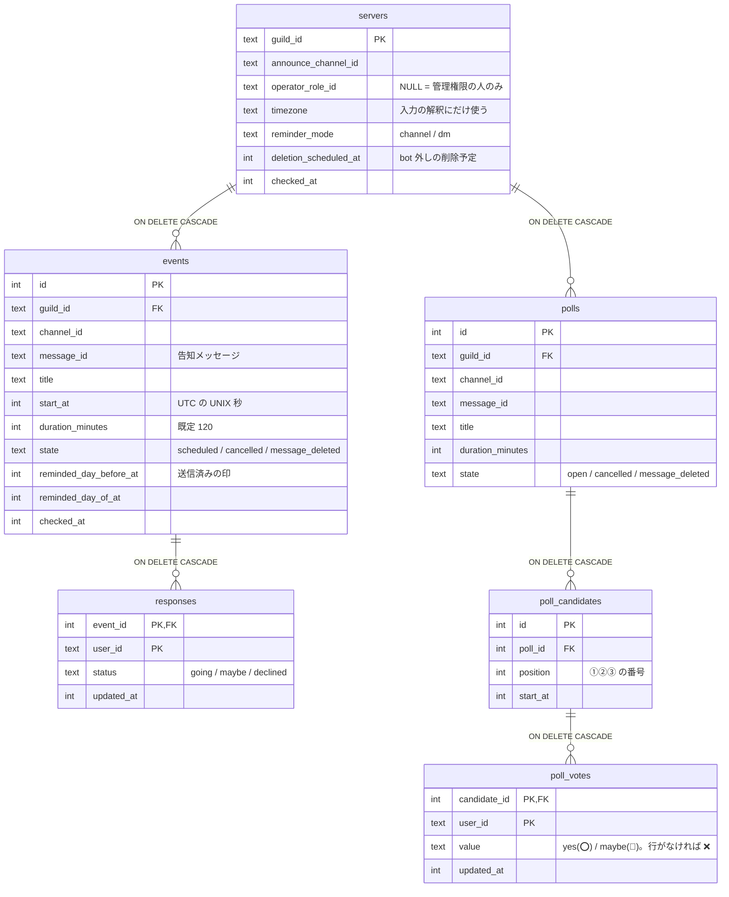
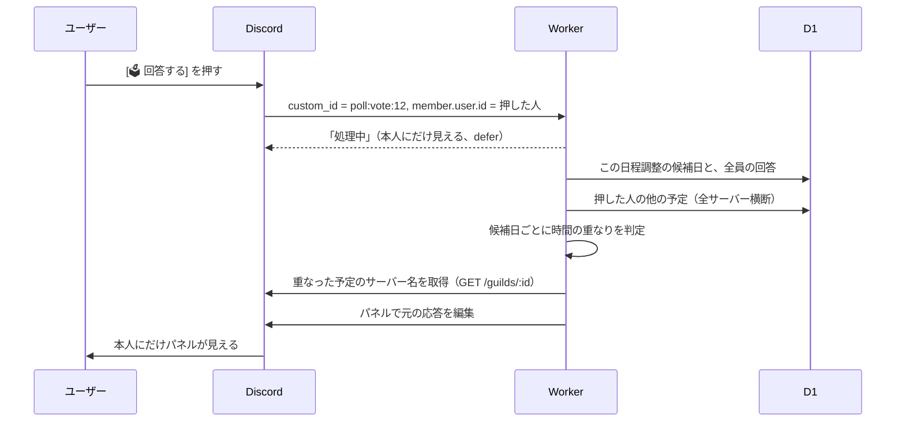

# 構成と仕組み

コードを読む前に全体像をつかむための資料。要件は [requirements.md](requirements.md)、セットアップ手順は [README](../README.md) を参照。

## 1. 全体像



- **常駐プロセスはない。** Discord からの HTTP リクエストと Cron が来たときだけ Worker が動く
- **状態はすべて D1 にある。** メモリには何も持たない（リクエストごとに別のインスタンスで動く可能性がある）
- Discord への書き込み（告知の投稿・編集、リマインド、DM）は bot トークンを使った REST API で行う
- ゲートウェイ（WebSocket）は使わない。bot が外された、メッセージが消された、といったイベントは受け取れないので、Cron で確認しに行く

## 2. ディレクトリと各ファイルの役割

```
src/
  index.ts            入口。fetch（インタラクション）と scheduled（Cron）
  verify.ts           Ed25519 署名検証
  router.ts           インタラクションの種類・コマンド名・custom_id で各ハンドラーに振り分け
  interaction.ts      応答の組み立て（本人にだけ見えるメッセージ、defer、フォローアップ）とログ
  env.ts              環境変数・シークレットの型と、数値設定の読み取り
  commands.ts         スラッシュコマンドの定義（scripts/register-commands.ts が登録に使う）
  time.ts             日時・所要時間・候補日の解釈、タイムゾーン変換
  render.ts           確定イベントの告知メッセージ（埋め込み・ボタン・名簿）
  renderPoll.ts       日程調整の投票メッセージ・回答パネル・詳細
  announcement.ts     告知メッセージの再描画と存在確認（REST で GET → PATCH）
  conflicts.ts        予定の重なり（全サーバー横断）
  handlers/
    setup.ts          /setup
    event.ts          /event とそのモーダル
    buttons.ts        確定イベントのボタン（出欠・詳細・中止）と重なり警告
    poll.ts           /poll とそのモーダル、日程調整のボタン・セレクトメニュー
    my.ts             /my
    forget.ts         /forget とその確認ボタン
    options.ts        コマンドのオプション・モーダル入力値の取り出し
  db/
    queries.ts        servers / events / responses のクエリ
    polls.ts          polls / poll_candidates / poll_votes のクエリ
  discord/
    rest.ts           Discord REST クライアント（429 の再試行、エラーコード）
    permissions.ts    管理権限・運営者の判定
  jobs/
    scheduled.ts      Cron 式ごとのジョブの振り分け、時間経過の削除
    reminders.ts      リマインド
    checks.ts         bot 外しの確認、告知メッセージの存在確認
migrations/           D1 のスキーマ（0001 → 0002 → 0003 の順に適用）
scripts/              コマンド登録スクリプト
test/                 テスト（Workers ランタイム + D1 上で、Discord API は偽物）
```

**読む順番のおすすめ:** `index.ts` → `router.ts` → `handlers/buttons.ts`（出欠ボタン。一番単純な往復）→ `handlers/poll.ts` → `conflicts.ts`

## 3. インタラクション 1 回の流れ



Discord は **3 秒以内の応答**を求める。応答の返し方は 3 種類ある。

| 返し方 | 使っている所 | 内容 |
|---|---|---|
| すぐ返す | `/setup`、エラー、詳細表示 | その場で結果を返す |
| メッセージの書き換え（`UPDATE_MESSAGE`） | 出欠ボタン、各種の確認画面 | ボタンが付いていたメッセージそのものを、応答で書き換える。REST の投稿レート制限を使わない |
| 後回し（defer） | `/event` `/poll` の作成、`/my`、回答パネル、確定・中止 | 先に「処理中」を返し、`ctx.waitUntil` で処理を続けてから REST で元の応答を編集する（`interaction.ts` の `defer`）。インタラクションのトークンは 15 分有効 |

誰が押したかは、Discord が送ってくるペイロードの `member.user.id` で分かる。署名を検証しているので、この値は Discord が保証したものとして扱える。

## 4. データモデル



**保存しないもの:** 場所・説明・主催者は DB に入れず、告知メッセージの埋め込みにだけ書く。再描画するときは、既存メッセージの埋め込みの本文（description）をそのまま引き継ぎ、名簿（fields）とボタンだけを DB から作り直す（`announcement.ts`、`handlers/buttons.ts`）。サーバー名も保存せず、表示のたびに REST で取得する。

**日程調整の確定:** 確定すると `events` に行を作り、⭕→`going`、🔺→`maybe` として `responses` に写し、`polls` を削除する（候補・投票は CASCADE で消える）。同じ告知メッセージ（`message_id`）を引き継ぐ。3 つの SQL を D1 の `batch`（1 トランザクション）で実行し、「まだ `open` なら」という条件を付けているので、同時に確定ボタンが押されてもイベントは 1 つしかできない（`db/polls.ts` の `confirmPoll`）。

## 5. ボタン・セレクトメニューの custom_id

常駐プロセスがないので、「どのイベントの、どの操作か」は `custom_id` に埋め込み、押されるたびに DB を引き直す。

| custom_id | 場所 | 操作 | 権限チェック |
|---|---|---|---|
| `rsvp:<イベントID>:going\|maybe\|declined` | 告知 | 出欠 | サーバー一致 |
| `detail:<イベントID>` | 告知 | 回答一覧 | — |
| `cancel:<イベントID>` / `cancelok:<イベントID>` | 詳細 | 中止の確認 / 実行 | 運営者 |
| `poll:vote:<日程調整ID>` | 投票 | 回答パネルを開く | サーバー一致 |
| `poll:yes:<ID>` / `poll:maybe:<ID>` | 回答パネル（セレクト） | ⭕ / 🔺 の保存 | サーバー一致 |
| `poll:detail:<ID>` | 投票 | 回答一覧 | — |
| `poll:pick:<ID>`（セレクト）→ `poll:confirm:<ID>:<候補ID>` | 詳細 | 確定する日の選択 / 実行 | 運営者 |
| `poll:cancel:<ID>` / `poll:cancelok:<ID>` | 詳細 | 中止の確認 / 実行 | 運営者 |
| `forget:past` / `forget:all` / `forget:allok` / `forget:cancel` | /forget | 削除 | 本人（ユーザー ID で削除） |

**権限はボタンが見えるかどうかに頼らない。** 中止・確定のボタンは運営者にしか表示しないが、押されたときにも毎回 `isOperator` で確認する。他サーバーのイベント ID を埋め込んだボタンが来ても、`event.guild_id !== interaction.guild_id` で弾く。

## 6. 回答パネルに個人の予定が出る仕組み

[🗳️ 回答する] を押してから、パネルが表示されるまでの流れ（`handlers/poll.ts` の `votePanel`、`conflicts.ts`）。



1. **誰の予定か:** Discord が送ってくる `member.user.id`（押した人）を使う。本人が名乗るわけではないので、他人の予定を見ることはできない
2. **予定の集め方（`collectBusy`）:** D1 に対して 2 つのクエリを投げる。どちらも **`guild_id` で絞り込まないので、この bot を入れている全サーバー分が対象になる**
   - 確定イベント: `responses` と `events` を結合し、その人が ✅ 参加・🤔 未定と答えていて、中止されておらず、候補日の範囲と時間が重なるもの（`listCommitmentsForUser`）
   - 別の日程調整: `poll_votes`・`poll_candidates`・`polls` を結合し、その人が ⭕・🔺 を付けた受付中の候補（今開いている日程調整自身は除く）（`listOpenPollVotesForUser`）
3. **重なりの判定（`overlapping`）:** 各候補を「開始〜開始＋所要時間」の区間とみなし、`予定の開始 < 候補の終了` かつ `予定の終了 > 候補の開始` なら重なりとする。所要時間はイベント・日程調整ごとの `duration_minutes`（既定 2 時間）
4. **サーバー名:** DB には保存していないので、重なった予定のサーバーだけ `GET /guilds/:id` で取る。取れなければサーバー名なしで表示する
5. **表示:** 本人にだけ見えるメッセージ（ephemeral）で返す。埋め込みの本文には Discord のタイムスタンプ記法（閲覧者の端末の時刻で表示される）で予定を並べる。セレクトメニューの選択肢はタイムスタンプ記法が使えないので、サーバーのタイムゾーンで「10/11(土) 19:00」と書き、説明欄に「⚠️ ✅「読書会」(サーバーB)と重なる」と出す
6. **選んだ後:** セレクトメニューで選ぶと、保存 → 公開の投票メッセージを再描画 → パネルを同じ手順で作り直して上書きする

**見えないもの・注意点**

- この bot で管理している予定しか分からない。Google カレンダーや他の bot の予定は見ない（要件で対象外）
- パネルは開いた時点の状態。別の画面で回答を変えたら、パネルを開き直すか何か選び直すと最新になる
- 他のメンバーには見えない（ephemeral）。公開の投票メッセージには重なりの情報を一切出さない
- 本人がすでに抜けたサーバーの予定も、回答が残っていれば表示される（メンバーの脱退は追跡していない。保存期間の経過か `/forget` で消える）

確定イベントの ✅・🤔 ボタンを押したときの警告も同じ `collectBusy` を使う。ボタンへの応答（告知の書き換え）を返した後に、`waitUntil` の中で重なりを調べ、あれば本人にだけ見える追加メッセージ（フォローアップ）を送る。

## 7. 定期ジョブ

| Cron（UTC） | ジョブ | ファイル |
|---|---|---|
| `0 * * * *` | リマインド | `jobs/reminders.ts` |
| `7 18 * * *` | 時間経過の削除（イベント・日程調整）、bot 外しの確認 | `jobs/scheduled.ts`、`jobs/checks.ts` |
| `37 18 * * *` | 告知メッセージの存在確認 | `jobs/checks.ts` |

- **リマインドの二重送信防止:** 送る前に `UPDATE ... SET reminded_x_at = now WHERE reminded_x_at IS NULL` で印を付け、1 行更新できたときだけ送る（同時に 2 回動いても片方しか送らない）。送信に失敗したら印を外し、次回（1 時間後）に送り直す
- **bot 外しの確認:** `GET /guilds/:id` が 403/404 なら削除予定の印を付け、猶予期間（`GUILD_GRACE_DAYS`、既定 14 日）後にサーバーごと削除する。5xx などは何もしない。再び到達できたら印を外す
- **呼び出し回数の上限:** Workers は 1 回の実行で出せるサブリクエスト数に上限があるので、各ジョブの Discord API 呼び出しは `SUBREQUEST_BUDGET`（既定 40）回まで。確認ジョブは最後に確認した時刻が古い順に処理し、数日かけて一巡する

## 8. セキュリティとプライバシーの要点

| 項目 | どこで | 内容 |
|---|---|---|
| 署名検証 | `verify.ts` | 全リクエストで Ed25519 を検証し、失敗は 401 |
| 権限 | `discord/permissions.ts` | 管理権限（Manage Server）か運営ロール。ボタン・モーダル送信のたびに確認 |
| メンション | 全メッセージ | `allowed_mentions: { parse: [] }`。名簿のメンションで通知は飛ばない。リマインドだけ、参加・未定の人を明示して通知する |
| 他サーバーの情報 | `conflicts.ts`、`/my` | 本人にだけ見えるメッセージでのみ出す |
| ログ | `interaction.ts` の `logError` | エラーの種類と API のパス・コードだけ。イベント名や回答内容は出さない |
| 保存期間 | `jobs/scheduled.ts` | 開始（日程調整は最後の候補日）から `RETENTION_DAYS`（既定 30 日）で物理削除 |
| シークレット | `wrangler secret` | 公開鍵・bot トークン・アプリ ID はリポジトリに入れない |

## 9. テスト

- `@cloudflare/vitest-pool-workers` で、本番と同じ Workers ランタイム（Miniflare）と D1 上で動かす。マイグレーションはテスト開始時に適用される（`test/setup.ts`）
- Discord API は `test/helpers.ts` の `FakeDiscord` で置き換えている（`fetch` を差し替え、メッセージ・サーバー・DM を記録する）。**実際の Discord の挙動（エラーコードなど）は検証していない**ので、要件 8 章の項目は実機で確認が必要
- テスト用の署名鍵は `vitest.config.ts` で毎回生成し、本物の署名検証を通している

## 10. 既知の制約・未対応

- 日程調整の告知メッセージが消されたかどうかは、毎日の確認ジョブの対象外（誰かが操作したときに検知する）
- 投票メッセージの再描画は、同時に何人も選ぶと順番が前後し、一時的に古い集計が表示されることがある（次の操作で直る）
- `/my` で他サーバー名を隠す設定、匿名化、特定イベントだけの `/forget` は未実装（要件のフェーズ3）
- `compatibility_date` と `.npmrc` の `legacy-peer-deps=true` は、テスト用パッケージとの兼ね合いで入れている
